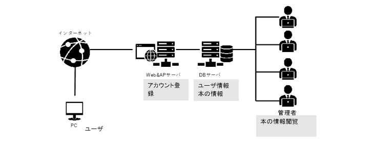
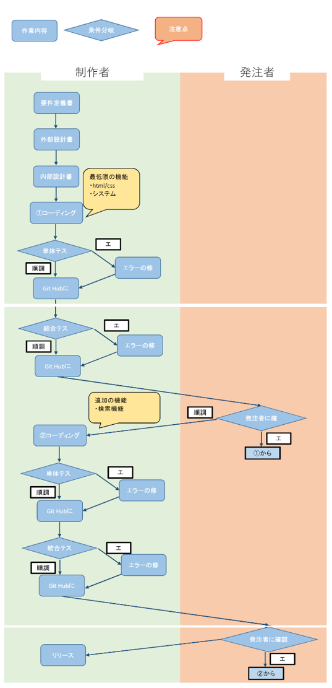

# Z Generation Libracy System 外部設計書

| 作成者 | Kyamy-Tech |
| ------ | ---------- |
| 作成日 | 2021/05/25 |

 

## **目次**

1. 画面一覧
2. 画面遷移図
3. 機能一覧
4. システム構成図
5. テーブル定義書
6. 業務フロー図

 

## **画面一覧**

全体の前提として TOP 画面とカート画面に遷移するボタンをヘッダーに表示する
| No | 画面名称 | 説明 | 機能名 | 備考 |
| ------ | ---------- | --- | --- | --- |
| 1 | ログイン画面 | ・ユーザ ID とパスワードを入力し、アカウントがあればログイン成功・アカウントがなけれ「新規登録ボタン」を押す ・管理者は管理者用の URL を押せば、管理画面に遷移する | ログイン | |
| 2 | 新規アカウント登録画面 | ・ユーザに学部・学年・名前・パスワード・ユーザ ID を入力してアカウントを作成する | ユーザ登録 | |
| 3 | TOP 画面 | ・「ようこそ〇〇さん」のメッセージを表示 ・本の検索のボタンを押すことで検索窓画面に遷移 ・ユーザと同じ学部の貸出数が多い順でランキングを表示させる（ログインしている日から過去 30 日間） ・ランキングには順位と本のタイトルと「詳細ボタン」を表示し、「詳細ボタン」を押すと本の詳細画面に遷移 | 本の検索 | |
| 4 | 検索窓画面 | ・テキストボックスでキーワードを入れて「検索ボタン」を押すと検索結果画面に遷移（キーワード曖昧検索） ・カテゴリを選べるプルダウンから選んで「検索ボタン」を押すと検索結果画面に遷移（カテゴリ検索） ・本のタイトルと著者で絞り込み検索も行う | 本の検索 | |
| 5 | 検索結果画面 | ・検索結果を一覧にして表示（タイトルのあいうえお順） ・検索結果にはタイトルとカテゴリと「詳細ボタン」を表示し、「詳細ボタン」を押すと本の詳細画面に遷移する | カートに追加 | |
| 6 | 本の詳細表示画面 | ・本のタイトル・カテゴリ・本の場所・著者・「カートに追加ボタン」「戻るボタン」を表示させる ・「戻るボタン」を押すと、検索結果画面に遷移する | カートに追加 | |
| 7 | カート画面 | ・ユーザがカートに追加した本の一覧を表示する（追加した順） ・本のタイトルと「詳細ボタン」」削除ボタン」「借りるボタン」を表示 ・「借りるボタン」を押すと、借りる（確認）画面に遷移する | カート内容編集 | |
| 8 | 借りる（確認）画面 | ・ユーザの借りようとしている本の一覧と「以上でよろしいでしょうか？」のメッセージと「確認ボタン」を表示する ・一覧には本のタイトルとカテゴリを表示する | 本を借りる | |
| 9 | 管理画面 | ・各本のユーザが借りた日時・学部・冊数・著者・タイトル・本の場所を表示 | 本の一覧表示 | |

 

## **画面遷移図**

 

## **機能一覧**

<table>
<tr>
<td rowspan="2">No</td>
<td colspan="3" text-align="center">機能名</td>
<td rowspan="2">区分</td>
<td rowspan="2">機能概要</td>
</tr>
<tr>
<td>大機能</td>
<td>中機能</td>
<td>小機能</td>
</tr>
<tr>
<td>1</td>
<td>ログイン</td>
<td></td>
<td></td>
<td></td>
<td>利用者がIDとPWを入力し、予め作成したアカウント情報を用いて個々人のランキングを表示する</td>
</tr>
<tr>
<td>2</td>
<td>ログアウト</td>
<td></td>
<td></td>
<td></td>
<td>セッションを終了する</td>
</tr>
<tr>
<td>3</td>
<td>新規登録</td>
<td>ユーザの追加</td>
<td>ユーザの保存</td>
<td></td>
<td>利用者がアカウントを作成する</td>
</tr>
<tr>
<td>4</td>
<td>ランキング表示</td>
<td>データの抽出範囲指定</td>
<td></td>
<td></td>
<td>30日間毎の本の貸し出し数を集計する。ユーザの学部ごとに上位10冊をランキング表示する</td>
</tr>
<tr>
<td>5</td>
<td>キーワード検索</td>
<td>曖昧検索</td>
<td>検索履歴ログの保持</td>
<td></td>
<td>指定したキーワードを含むデータを抽出し表示する</td>
</tr>
<tr>
<td>6</td>
<td>カテゴリー検索</td>
<td>データにカテゴリー情報を保持</td>
<td>検索履歴ログの保持</td>
<td></td>
<td>指定したカテゴリー情報を持つデータを抽出し表示する</td>
</tr>
<td>7</td>
<td>検索結果一覧表示</td>
<td>並び替え機能（昇順）</td>
<td></td>
<td></td>
<td>検索によって抽出されたデータをタイトル順に表示する</td>
</tr>
<td>8</td>
<td>本の詳細表示</td>
<td>カートへの追加</td>
<td>前画面に戻る</td>
<td></td>
<td>本の詳細（タイトル・著者・本の保管場所）を表示する</td>
</tr>
<td>9</td>
<td>本の貸し出し</td>
<td>データとユーザの集計</td>
<td></td>
<td></td>
<td>本の貸し出しを記録する</td>
</tr>
<td>10</td>
<td>カート内一覧表示</td>
<td>カートから削除</td>
<td>本の詳細表示</td>
<td></td>
<td>詳細表示画面でカートに追加した本を表示する</td>
</tr>
<td>11</td>
<td>管理者機能</td>
<td>蔵書のデータを表示</td>
<td></td>
<td></td>
<td>検索履歴ログ・学部ごとの貸し出し数を表示する</td>
</tr>
</table>

 

## **システム構成図**

 

## **テーブル定義書**

### _ユーザ管理テーブル_

| テーブル名 | 内容説明 |
| - | - |
| user | 登録されているユーザを管理するテーブル |

| No | 日本語名称 | 列名 | 列タイプ | 桁数 | NOT NULL | UNIQ | 主キー | Index | 初期値 | 説明/備考 | コード説明 | DB制約 | 特記事項 |
| ------ | ---------- | --- | --- | --- | ------ | ---------- | --- | --- | --- | ------ | ---------- | --- | --- |
| 1 | ユーザID | id | CHAR | 20.0 | 〇 | 〇 | 〇 |  |  |  |  |  |  |
| 2 | 名前 | name | CHAR | 20.0 | 〇 |  |  |  |  |  |  |  |  |
| 3 | パスワード | password | CHAR | 20.0 | 〇 |  |  |  |  |  |  |  |  |
| 4 | 学年 | graduate | INT | 8.0 | 〇 |  |  |  |  |  |  |  |  |
| 5 | 学部 | undergraduate | CHAR | 20.0 | 〇 |  |  |  |  |  |  |  |  |

 

### _本管理テーブル_

| テーブル名 | 内容説明 |
| - | - |
| book | 登録されている本を管理するテーブル |

| No | 日本語名称 | 列名 | 列タイプ | 桁数 | NOT NULL | UNIQ | 主キー | Index | 初期値 | 説明/備考 | コード説明 | DB制約 | 特記事項 |
| ------ | ---------- | --- | --- | --- | ------ | ---------- | --- | --- | --- | ------ | ---------- | --- | --- |
| 1 | 本ID | id | CHAR | 20.0 | 〇 | 〇 | 〇 |  |  |  |  |  |  |
| 2 | タイトル | title | CHAR | 40.0 | 〇 |  |  |  |  |  |  |  |  |
| 3 | 本のカテゴリ | category | CHAR | 20.0 | 〇 |  |  |  |  |  |  |  |  |
| 4 | 著者 | name | INT | 8.0 | 〇 |  |  |  |  |  |  |  |  |
| 5 | 場所 | place | CHAR | 20.0 | 〇 |  |  |  |  |  |  |  |  |
| 6 | 経済学部の貸出数 | keizai | CHAR | 10.0 |  |  |  |  |  |  |  |  |  |
| 7 | 法学部の貸出数 | hougaku | CHAR | 10.0 |  |  |  |  |  |  |  |  |  |
| 8 | 理学部の貸出数 | rigaku | CHAR | 10.0 |  |  |  |  |  |  |  |  |  |
| 9 | 工学部の貸出数 | kougaku | CHAR | 10.0 |  |  |  |  |  |  |  |  |  |
| 10 | 文学部の貸出数 | bungaku | CHAR | 10.0 |  |  |  |  |  |  |  |  |  |
| 11 | 医学部の貸出数 | igaku | CHAR | 10.0 |  |  |  |  |  |  |  |  |  |

 

### _本の貸出管理テーブル_

| テーブル名 | 内容説明 |
| - | - |
| history | ユーザが本を貸し出した履歴を管理するテーブル |

| No | 日本語名称 | 列名 | 列タイプ | 桁数 | NOT NULL | UNIQ | 主キー | Index | 初期値 | 説明/備考 | コード説明 | DB制約 | 特記事項 |
| ------ | ---------- | --- | --- | --- | ------ | ---------- | --- | --- | --- | ------ | ---------- | --- | --- |
| 1 | 本ID | book_id | CHAR | 20.0 | 〇 | 〇 | 〇 |  |  |  |  |  |  |
| 2 | タイトル | title | CHAR | 20.0 | 〇 |  |  |  |  |  |  |  |  |
| 3 | ユーザID | user_id | CHAR | 20.0 | 〇 |  |  |  |  |  |  |  |  |
| 4 | ユーザの名前 | name | INT | 20.0 | 〇 |  |  |  |  |  |  |  |  |
| 5 | 日時 | datetime | DATE |  | 〇 |  |  |  |  |  |  |  |  |

 

## **業務フロー図**

 
