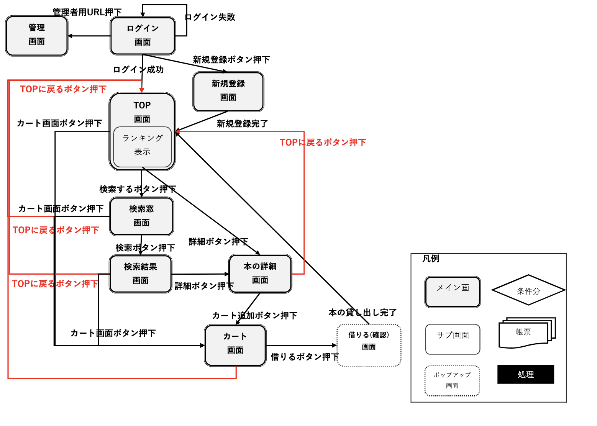

# Z Generation Libracy System 外部設計書

| 作成者 | Kyamy-Tech |
| ------ | ---------- |
| 作成日 | 2021/05/25 |

 

## **目次**

1. 画面一覧
2. 画面遷移図
3. 機能一覧
4. システム構成図
5. テーブル定義書
6. 業務フロー図

 

## **画面一覧**

全体の前提として TOP 画面とカート画面に遷移するボタンをヘッダーに表示する
| No | 画面名称 | 説明 | 機能名 | 備考 |
| ------ | ---------- | --- | --- | --- |
| 1 | ログイン画面 | ・ユーザ ID とパスワードを入力し、アカウントがあればログイン成功・アカウントがなけれ「新規登録ボタン」を押す ・管理者は管理者用の URL を押せば、管理画面に遷移する | ログイン | |
| 2 | 新規アカウント登録画面 | ・ユーザに学部・学年・名前・パスワード・ユーザ ID を入力してアカウントを作成する | ユーザ登録 | |
| 3 | TOP 画面 | ・「ようこそ〇〇さん」のメッセージを表示 ・本の検索のボタンを押すことで検索窓画面に遷移 ・ユーザと同じ学部の貸出数が多い順でランキングを表示させる（ログインしている日から過去 30 日間） ・ランキングには順位と本のタイトルと「詳細ボタン」を表示し、「詳細ボタン」を押すと本の詳細画面に遷移 | 本の検索 | |
| 4 | 検索窓画面 | ・テキストボックスでキーワードを入れて「検索ボタン」を押すと検索結果画面に遷移（キーワード曖昧検索） ・カテゴリを選べるプルダウンから選んで「検索ボタン」を押すと検索結果画面に遷移（カテゴリ検索） ・本のタイトルと著者で絞り込み検索も行う | 本の検索 | |
| 5 | 検索結果画面 | ・検索結果を一覧にして表示（タイトルのあいうえお順） ・検索結果にはタイトルとカテゴリと「詳細ボタン」を表示し、「詳細ボタン」を押すと本の詳細画面に遷移する | カートに追加 | |
| 6 | 本の詳細表示画面 | ・本のタイトル・カテゴリ・本の場所・著者・「カートに追加ボタン」「戻るボタン」を表示させる ・「戻るボタン」を押すと、検索結果画面に遷移する | カートに追加 | |
| 7 | カート画面 | ・ユーザがカートに追加した本の一覧を表示する（追加した順） ・本のタイトルと「詳細ボタン」」削除ボタン」「借りるボタン」を表示 ・「借りるボタン」を押すと、借りる（確認）画面に遷移する | カート内容編集 | |
| 8 | 借りる（確認）画面 | ・ユーザの借りようとしている本の一覧と「以上でよろしいでしょうか？」のメッセージと「確認ボタン」を表示する ・一覧には本のタイトルとカテゴリを表示する | 本を借りる | |
| 9 | 管理画面 | ・各本のユーザが借りた日時・学部・冊数・著者・タイトル・本の場所を表示 | 本の一覧表示 | |

 

## **画面遷移図**

 

## **機能一覧**

| header1 | header2 | header3 |
| :------ | :-----: | ------: |
| hoge    |  fuga   |    piyo |
| hoge    |    ^    |       ^ |
| hoge    |  fuga   |       ^ |

 

## **機能要件**

### _ユーザ画面関連_

- 初めに登録する本の冊数は 50 冊
- 本のカテゴリに種類は 6 種類
- TOP 画面に表示するランキングは、ログインするユーザの学部ごとの本の貸出数
- 検索までに表示するものは、あいまい検索をするキーワード入力欄と、本のカテゴリ別のランキングを検索結果に画面に表示
- ランキング表示画面は、今日から前 30 日の上位 10 冊のランキングとする。本のタイトル・著者・詳細ボタンがある
- ランキング表示機能のデザインはアイコンや色違いなどに配慮したものにする
- ログインした際に、「ようこそ〇〇さん」と表示する
- ログイン後の画面では、常にカートボタン・ログアウトボタン・TOP ボタンが表示されている
- 詳細画面には本のタイトル・著者・場所が記載されており、カートに追加・検索結果に戻るボタンがある

 

### _管理者画面関連_

- URL を直接入力することで、管理画面を表示する

 

## **納期**

| 用語       | 解説                                                                                                                                     |
| ---------- | ---------------------------------------------------------------------------------------------------------------------------------------- |
| 利用者     | 大学の図書館システムで、蔵書を借りたり、検索したりする人 利用者は図書館システムのアカウントを持つことでシステムを利用することができる |
| 管理者     | 図書館の職員 蔵書を管理する役割があり、図書館のアカウントでログインすることで蔵書に関するデータを閲覧することができる                 |
| カート     | 利用が借りる予定の蔵書を一時保存し閲覧するための機能                                                                                     |
| ランキング | 蔵書が貸出された回数を順位付けし一覧としたもの 学部ごと、30 日毎に集計している                                                        |
| 学部       | ユーザとして登録する情報                                                                                                                 |
