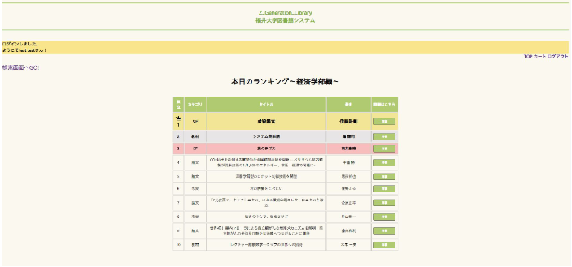

# Z Generation Libracy System 内部設計書

| 作成者 | Kyamy-Tech |
| ------ | ---------- |
| 作成日 | 2021/05/25 |

<br>

## **目次**

1. ファイル構成
2. 画面詳細設計
3. クラス図
5. ER図

<br>

## **ファイル構成**

```
kyamy-tech
├── README.md
├── .gitignore
├── docs/
├── sql/
│　　├── C_book.sql
│　　├── C_history.sql
│　　├── C_user.sql
│　　└── Z_Generation_Library_BackUp.sql
└── src/
 　　├── run.py
 　　├── admin/
 　　│　　├── __init__.py
 　　│　　├── config.py
 　　│　　├── templates/
 　　│　　│　　├── layout.html
 　　│　　│　　├── top.html
 　　│　　│　　├── admin/
 　　│　　│　　│　　└── admin.html
 　　│　　│　　├── carts/
 　　│　　│　　│　　└── index.html
 　　│　　│　　├── details/
 　　│　　│　　│　　└── details.html
 　　│　　│　　├── login/
 　　│　　│　　│　　└── login.html
 　　│　　│　　├── search/
 　　│　　│　　│　　├── result.html
 　　│　　│　　│　　└── window.html
 　　│　　│　　└── signup/
 　　│　　│　　 　　└── signup.html
 　　│　　└── views
 　　│　　 　　├── admin.py
 　　│　　 　　├── carts.py
 　　│　　 　　├── details.py
 　　│　　 　　├── login.py
 　　│　　 　　├── search.py
 　　│　　 　　└── signup.py
 　　└── lib/
 　　 　　├── config.py
 　　 　　├── db.py
 　　 　　└── models/
 　　 　　 　　├── __init__.py
 　　 　　 　　├── book.py
 　　 　　 　　├── history.py
 　　 　　 　　└── user.py
```

<br>

## **画面詳細設計**

### _ログイン画面_


- システムの初期画面
- ユーザがアカウントをすでに所持している場合、ユーザIDとパスワードを入力し、ログインボタンを押すことでTOP画面に遷移する
- ユーザが入力したIDがusersテーブルに無かった場合、「ユーザIDが違います」と表示する
- ユーザが入力したパスワードが該当ユーザのパスワードと一致しなかった場合、「パスワードが違います」と表示する
- 「新規登録」をクリックすると、新規登録画面に遷移する

<br>

### _新規登録画面_


- ログイン画面より遷移する
- ユーザが情報を入力したのち、アカウントが追加される
- すでに同じIDのアカウントがあれば、「これは既に登録されているIDです」と表示する
- 名前のテキストボックスが空欄の場合、「名前を入力して下さい」と表示する
- ユーザIDのテキストボックスが空欄の場合、「ユーザIDを入力して下さい」と表示する
- パスワードのテキストボックスが空欄の場合、「パスワードを入力して下さい」と表示する
- 入力情報に不備があった場合、「入力した情報を再度確認して下さい」と表示する
- 入力情報に不備がなく、返信ボタンを押下すると、「アカウントが作成されました」と表示し、ログイン画面に遷移する

<br>

### _TOP画面_



- 「ログインしました」、「ようこそ○○さん」のメッセージを表示する（○○はログインしたユーザ名）
- 「検索画面へGO!」ボタンをクリックすると、検索窓表示画面に遷移する
- ユーザと同じ学部の貸出数が多い順でランキングを表示させる（ログインしている日から過去30日間）
- ランキングには順位と本のタイトルと「詳細ボタン」を表示し、「詳細ボタン」を押下すると本の詳細画面に遷移する

<br>

### _検索窓表示画面_


- テキストボックスでキーワードを入れて「検索ボタン」を押下すると、検索結果画面に遷移する（キーワード曖昧検索）
- カテゴリを選べるプルダウンから選んで「検索ボタン」を押下すると、検索結果画面に遷移する（カテゴリ検索）
- 本のタイトルと著者を選択して「検索ボタン」を押下すると、検索結果画面に遷移する（絞り込み検索）

<br>

### _検索結果表示画面_


- 検索窓表示で指定した項目から、booksテーブルを参照し、参照結果を表示する
- 「カテゴリ」「タイトル」「著者」「本の場所」「詳細」カラムが表示される
- 表示された本は、タイトルの昇順で表示する
- 「詳細ボタン」を押下すると、本の詳細画面に遷移する

<br>

### _カート画面_


- ユーザがカートに追加した本の一覧を表示する（追加した順）
- 本の「カテゴリ」「タイトル」「著者」「削除ボタン」「全削除」「借りるボタン」を表示する
- 「借りる」ボタンを押下すると、ポップアップを表示する
- カートに図書がない状態で「借りるボタン」を押下すると、「図書がありません」と表示する
- カートに図書がある状態で「借りるボタン」を押下すると、「よろしいですか？」と表示する
  - 「キャンセル」を押下すると、「キャンセルされました」と表示する
  - 「OK」を押下すると、「借りました！」と表示され、下記テーブルにデータを挿入する
    - histories：「本id」「ユーザid」「日付」
    - books：ユーザが所属している学部と同じ名前のカラムをカウントアップ
- 「削除」ボタンを押下すると、該当の図書がカートから削除され、「商品が削除されました」と表示する
- 「全削除」ボタンを押下すると、カート内の全図書がカートから削除され、「商品が削除されました」と表示する

<br>

### _詳細画面_


- TOP画面の詳細から、もしくは、検索結果画面の詳細から、詳細画面を表示する
- 表示する項目は、以下とする
  - 本のタイトル
  - 本の著者
  - カテゴリー
  - 本の場所
  - カートに追加ボタン
- カートに追加ボタンをクリックすると、「カートに追加されました」とメッセージを表示する

<br>

### _管理者画面_


- 管理者がめんのURLを直接入力することで画面を表示する
- 管理画面に表示する項目は以下である
  - 本のid
  - 本のタイトル
  - 本のカテゴリー
  - 経済学部
  - 法学部
  - 理学部
  - 工学部
  - 文学部
  - 医学部
- 学部が表示されている列は、各学部に所属するユーザが借りた本の数を表示する

<br>

## **クラス図**

### _サービス機能クラス図_


<br>

### _管理機能クラス図_


<br>

## **ER図**


<br>
