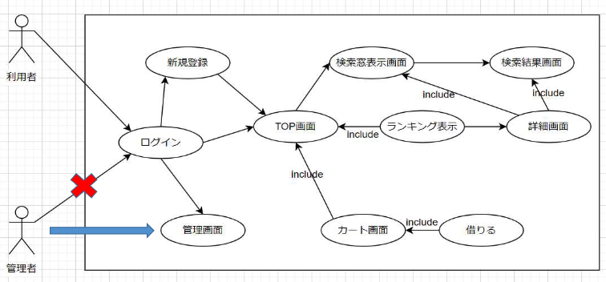

# Z Generation library System 要件定義書

| 作成者 | Kyamy-Tech |
| ------ | ---------- |
| 作成日 | 2021/05/24 |

 

## **目次**

1. 機能一覧
2. ユースケース図
3. 要求概要
   1. ユースケース記述書 1
   2. ユースケース記述書 2
   3. ユースケース記述書 3
4. 機能概要求
5. 用語集

 

## **機能一覧**

- ログイン
- ログアウト
- 新規登録
- ランキング表示
- キーワード検索
- カテゴリー検索
- 本の詳細表示
- 本の貸出
- カート内一覧表示
- 管理者機能

 

## **ユースケース図**

 

## **要求概要**

### _ユースケース記述書 1_

| ユースケース名 | アカウント                                                                                                                                                                                                                                             |
| -------------- | ------------------------------------------------------------------------------------------------------------------------------------------------------------------------------------------------------------------------------------------------------ |
| 概要           | ID と PW を入力して TOP ページにアクセスするページ                                                                                                                                                                                                     |
| アクター       | 利用者                                                                                                                                                                                                                                                 |
| 事前条件       | システムが利用できること                                                                                                                                                                                                                               |
| 事後条件       | TOP ページにアクセスできたこと 新規アカウントが DB に追加されたこと                                                                                                                                                                                 |
| 基本系列       | 【ログイン】 アクターは ID と PW を入力する システムは TOP 画面に遷移する  【新規登録】 アクターは ID・PW・名前・学年・学部を入力する システムはログインページに遷移する  【管理者ログイン】 システムは管理者画面に遷移する |
| 代表系列       | ID と PW が DB 内のデータと一致しない場合、ログイン画面にステイする 新規登録した ID がすでに DB に存在した場合、ID の再入力を求める                                                                                                                 |
| 例外系列       | システム上のエラーが発生した時、ログイン画面に戻る                                                                                                                                                                                                     |
| 備考           |                                                                                                                                                                                                                                                        |

 

### _ユースケース記述書 2_

| ユースケース名 | 蔵書を検索する                                                                                                                                                                                                                                                     |
| -------------- | ------------------------------------------------------------------------------------------------------------------------------------------------------------------------------------------------------------------------------------------------------------------ |
| 概要           | アクターは検索画面にて蔵書を検索する                                                                                                                                                                                                                               |
| アクター       | 蔵書を借りたい利用者                                                                                                                                                                                                                                               |
| 事前条件       | システムが利用できること                                                                                                                                                                                                                                           |
| 事後条件       | 検索の結果がアクターに提供されたこと                                                                                                                                                                                                                               |
| 基本系列       | 1. TOP 画面より検索を選択する 2. システムは検索画面に遷移する 3. システムは検索するための情報の提供を促す 4. アクターは検索するための情報を提供する 5. システムは提供された情報を下に検索し、検索結果をアクターに提供する 6. ユースケースを終了する |
| 代表系列       | 検索した結果、該当する蔵書がない場合（基本系列 5） 1. システムは該当する蔵書がないことを利用者に通知する 2. ユースケースを終了する                                                                                                                           |
| 例外系列       | 蔵書がシステムから読み取れない場合（基本系列 5） 1. システムは読み取れないことをアクターに通知する 2. ユースケースを終了する                                                                                                                                 |
| 備考           | 検索時の情報の提供方法は、キーボード入力からカテゴリー選択、またはその両方を用いる                                                                                                                                                                                 |

 

### _ユースケース記述書 3_

| ユースケース名 | 借りる                                                                                                                                                                                                                                                                                                                                                                                                                                                                 |
| -------------- | ---------------------------------------------------------------------------------------------------------------------------------------------------------------------------------------------------------------------------------------------------------------------------------------------------------------------------------------------------------------------------------------------------------------------------------------------------------------------- |
| 概要           | アクターが読みたい本を借りる                                                                                                                                                                                                                                                                                                                                                                                                                                           |
| アクター       | 利用者                                                                                                                                                                                                                                                                                                                                                                                                                                                                 |
| 事前条件       | システムが利用できること                                                                                                                                                                                                                                                                                                                                                                                                                                               |
| 事後条件       | 利用者が本を借りた状態になる                                                                                                                                                                                                                                                                                                                                                                                                                                           |
| 基本系列       | 1. 本の詳細画面に遷移する 2. 詳細画面に表示されている「カート追加」ボタンを押す 3. アクターのカートに本を追加する  1. カート画面にはアクターがカートに追加した本の一覧が表示されている 2. カート画面に表示されている「借りる」ボタンを押すことで確認画面に遷移する 3. カートに入れたアクターが借りる本の一覧を確認する 4. 確認が取れれば、カート画面に手続き完了メッセージを表示する 5. 借りた本の情報とアクターの情報を管理サイトに反映させる |
| 代表系列       |                                                                                                                                                                                                                                                                                                                                                                                                                                                                        |
| 例外系列       | カート内に本がない場合、「借りる」ボタンを押した際にエラーメッセージが表示される                                                                                                                                                                                                                                                                                                                                                                                       |
| 備考           |                                                                                                                                                                                                                                                                                                                                                                                                                                                                        |

 

## **機能要件**

### _ユーザ画面関連_

- 初めに登録する本の冊数は 50 冊
- 本のカテゴリに種類は 6 種類
- TOP 画面に表示するランキングは、ログインするユーザの学部ごとの本の貸出数
- 検索までに表示するものは、あいまい検索をするキーワード入力欄と、本のカテゴリ別のランキングを検索結果に画面に表示
- ランキング表示画面は、今日から前 30 日の上位 10 冊のランキングとする。本のタイトル・著者・詳細ボタンがある
- ランキング表示機能のデザインはアイコンや色違いなどに配慮したものにする
- ログインした際に、「ようこそ〇〇さん」と表示する
- ログイン後の画面では、常にカートボタン・ログアウトボタン・TOP ボタンが表示されている
- 詳細画面には本のタイトル・著者・場所が記載されており、カートに追加・検索結果に戻るボタンがある

 

### _管理者画面関連_

- URL を直接入力することで、管理画面を表示する

 

## **納期**

| 用語       | 解説                                                                                                                                     |
| ---------- | ---------------------------------------------------------------------------------------------------------------------------------------- |
| 利用者     | 大学の図書館システムで、蔵書を借りたり、検索したりする人 利用者は図書館システムのアカウントを持つことでシステムを利用することができる |
| 管理者     | 図書館の職員 蔵書を管理する役割があり、図書館のアカウントでログインすることで蔵書に関するデータを閲覧することができる                 |
| カート     | 利用が借りる予定の蔵書を一時保存し閲覧するための機能                                                                                     |
| ランキング | 蔵書が貸出された回数を順位付けし一覧としたもの 学部ごと、30 日毎に集計している                                                        |
| 学部       | ユーザとして登録する情報                                                                                                                 |
